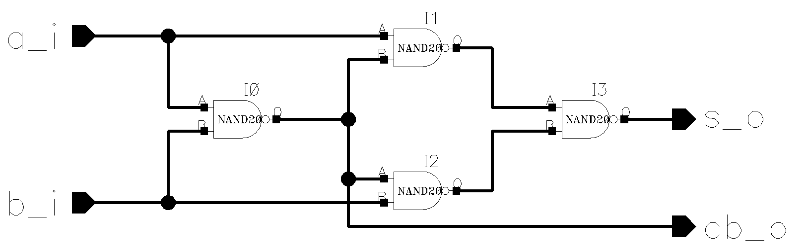
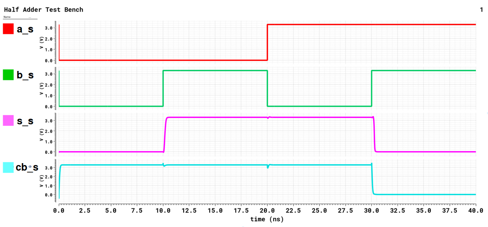
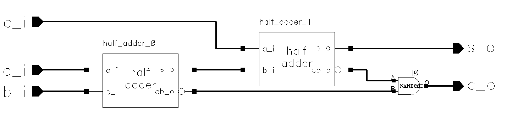
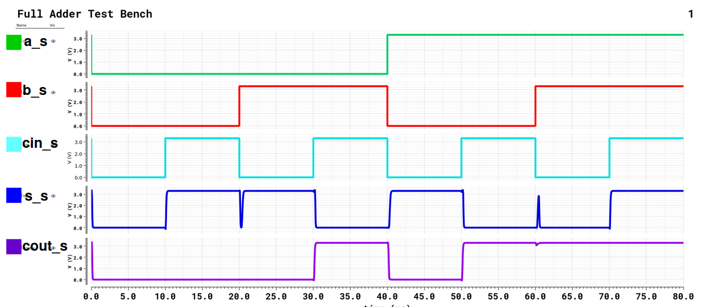
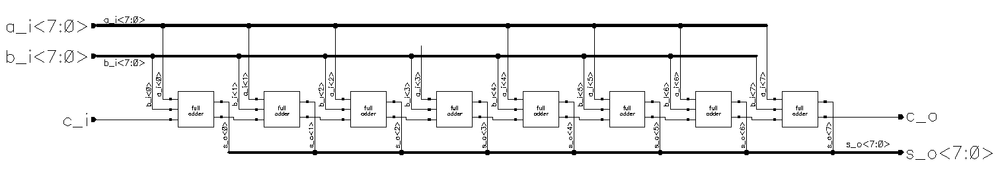
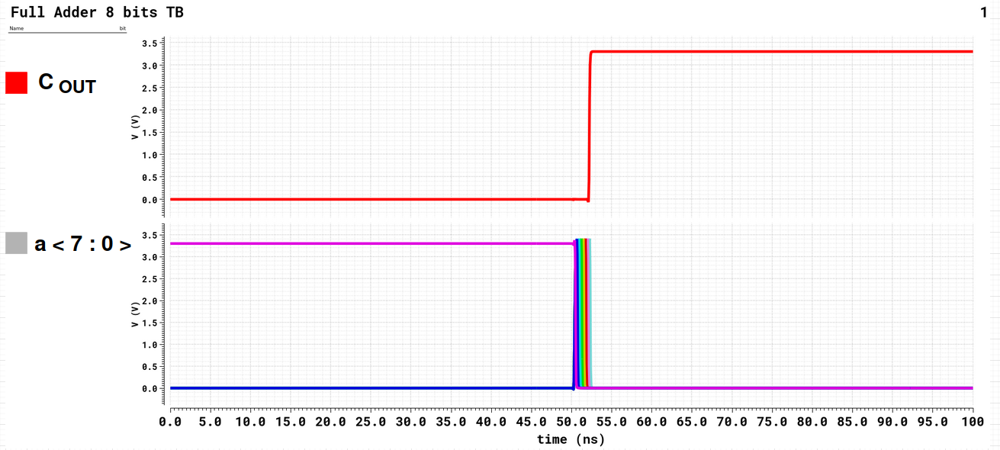

# 8-bit Adder — AMS 0.35 µm (Cadence Virtuoso)

Modular implementation of an **8-bit adder** in **Cadence Virtuoso**, using the **AMS 0.35 µm CMOS** technology.  
The goal was to practice **schematic editing**, **simulation**, and **hierarchical organization** of digital blocks.

---

## 🔎 Overview
The circuit was built hierarchically:
1. **NAND** gate as the base cell  
2. **Half Adder** built only with NANDs  
3. **Full Adder** using two Half Adders  
4. Connection of eight **Full Adders** to form the complete **8-bit adder**  

This modular approach enables **block reuse**, **clear hierarchy**, and validation at each design level.

---

## 🧩 Project structure

### Half Adder
Basic block performing `S = A ⊕ B` and `C_b = A · B`, implemented using only NAND gates.

**Schematic (Virtuoso)**  

**Simulation result (ADE XL)**  

---

### Full Adder (1 bit)
Built with two Half Adders in series, summing three inputs (`A`, `B`, `C_in`) and producing `S` and `C_out`.

**Schematic (Virtuoso)**  

**Waveforms**  

---

### 8-bit Adder
Hierarchical connection of eight Full Adders, with two 8-bit input buses (`a_s<7:0>`, `b_s<7:0>`) and carry propagation between stages.

**Schematic (Virtuoso)**  

During testing, **specific input combinations** were applied to analyze the **worst-case propagation delay**.  
Inputs were configured to force **full carry propagation** from the least significant bit to the most significant bit,  
for example using `a_s<7:0> = 11111111`, `b_s<7:0> = 00000000`, and `C_in = 1`.

**Simulation result**  

> In this scenario, the carry propagates through all stages, and `C_out` remains high at the end of the cycle — confirming the expected worst-case behavior.

---

## ⏱️ Critical path estimation
Since the **carry** traverses all 8 stages, it dominates the total propagation delay.  
Each **1-bit full adder** contributes two NAND gate delays, and the last stage adds three:

$$
\tau = 7 \cdot 2\alpha + 1 \cdot 3\alpha = 17\alpha
$$

where $\alpha$ is the delay of a single **NAND** gate.

---

## 🗂️ Suggested folder structure

